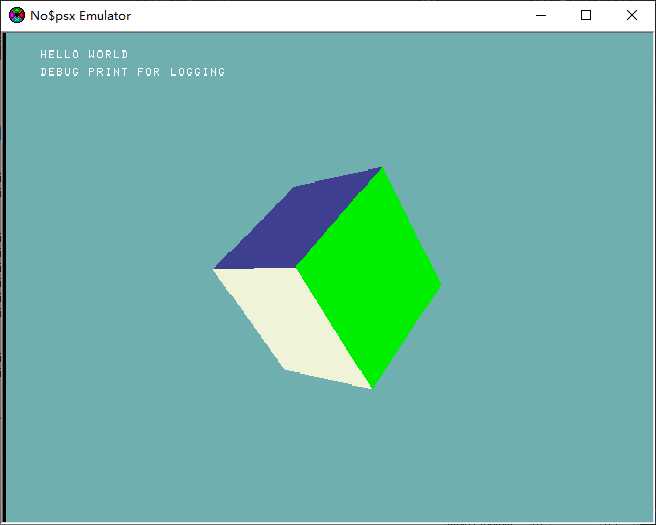

# PSX_helloworld

A basic psx/psone app

# Config PSX toolchain

1. Download PSX toolchain
    - PSY-Q SDK: https://drive.google.com/file/d/0B_GAaDjR83rLZGVaZ2pvV2tjSVE/view?usp=sharing&resourcekey=0-KKkvWLASG3gmlP3jNqZskQ
2. Config GCC mips
    - linux
        - Debian: `sudo apt install g++-mipsel-linux-gnu cpp-mipsel-linux-gnu binutils-mipsel-linux-gnu`
        - Arch: `trizen -S cross-mipsel-linux-gnu-binutils cross-mipsel-linux-gnu-gcc`
    - windows
        1. http://static.grumpycoder.net/pixel/mips/g++-mipsel-none-elf-10.3.0.zip
        2. and add the bin folder to `$PATH`

# Referencs
- https://github.com/grumpycoders/pcsx-redux
- https://github.com/Lameguy64/PSn00bSDK
- https://www.psxdev.net/downloads.html
- [no$psx](https://problemkaputt.de/psx.htm)
